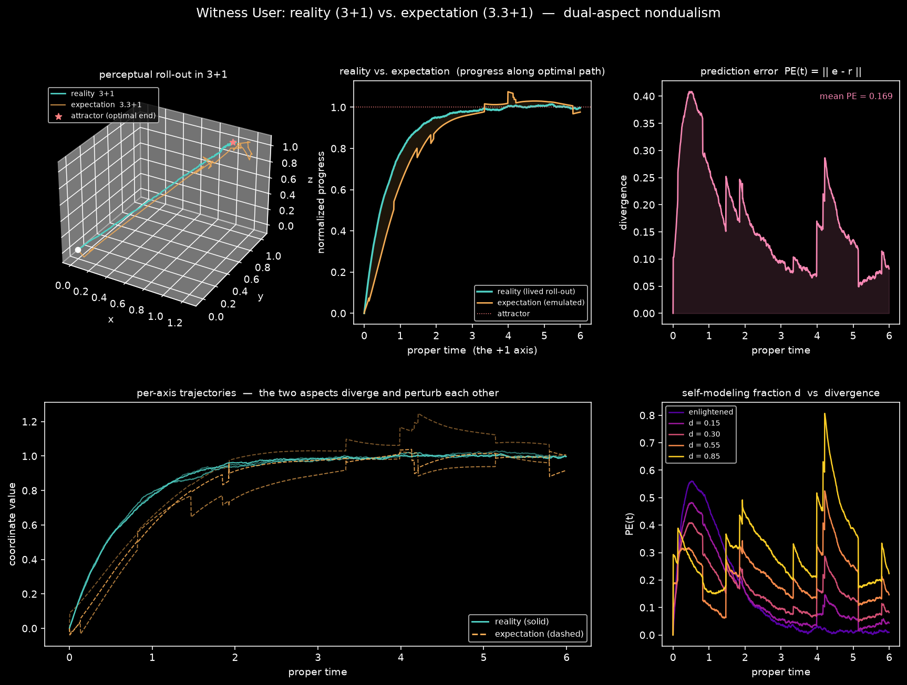
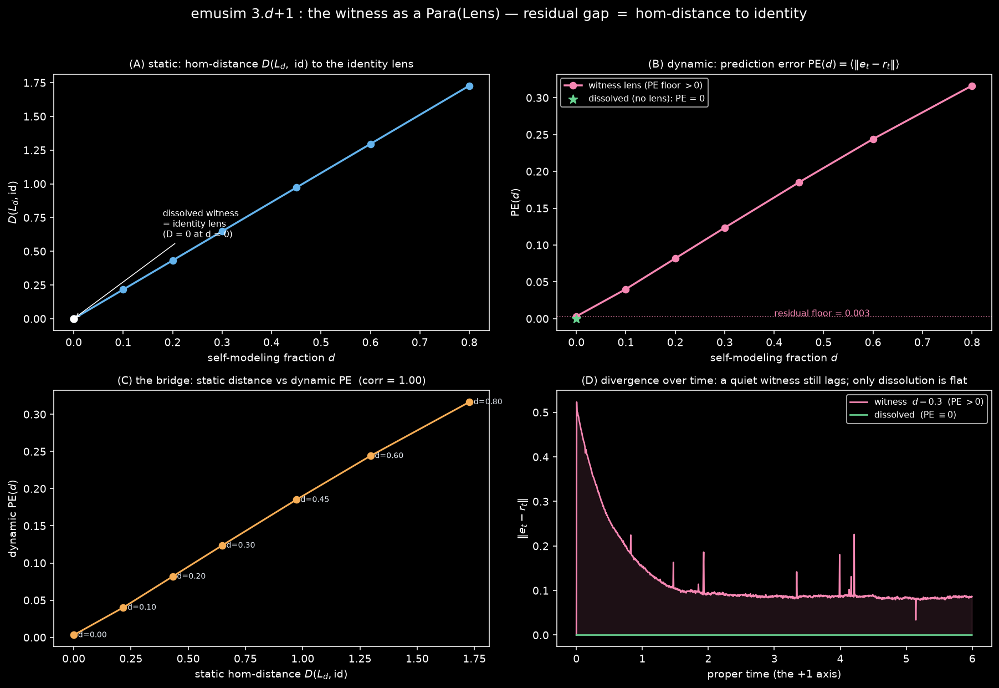
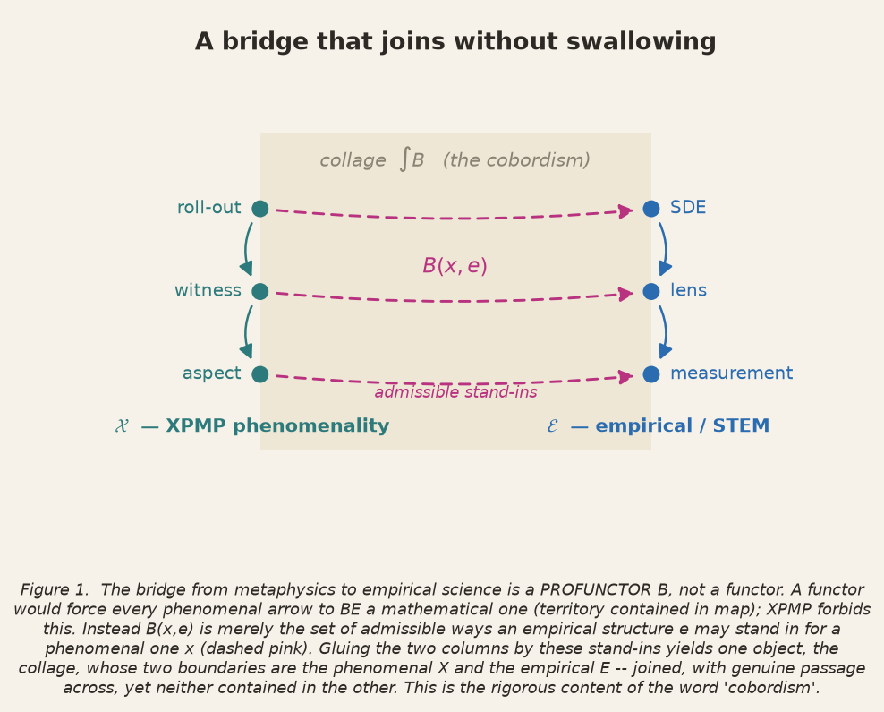
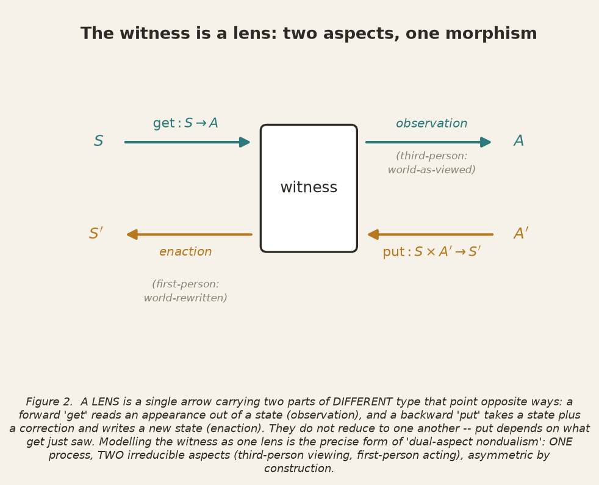
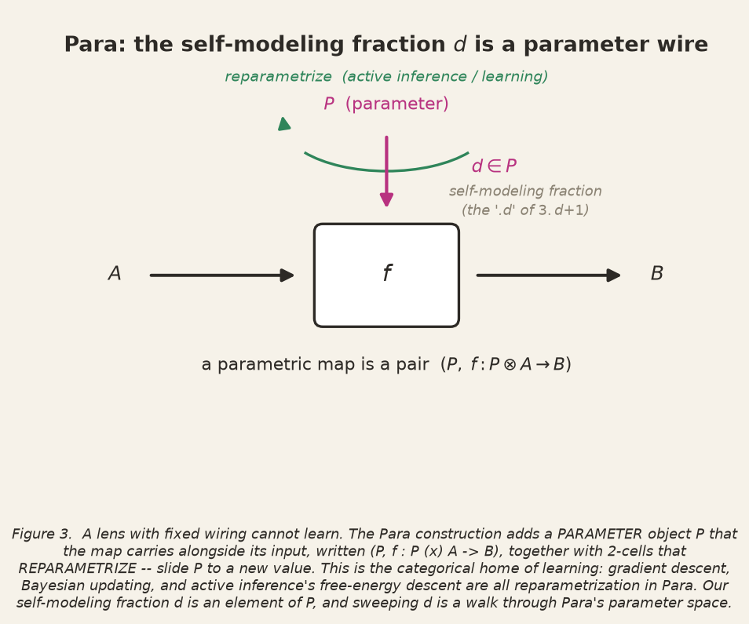
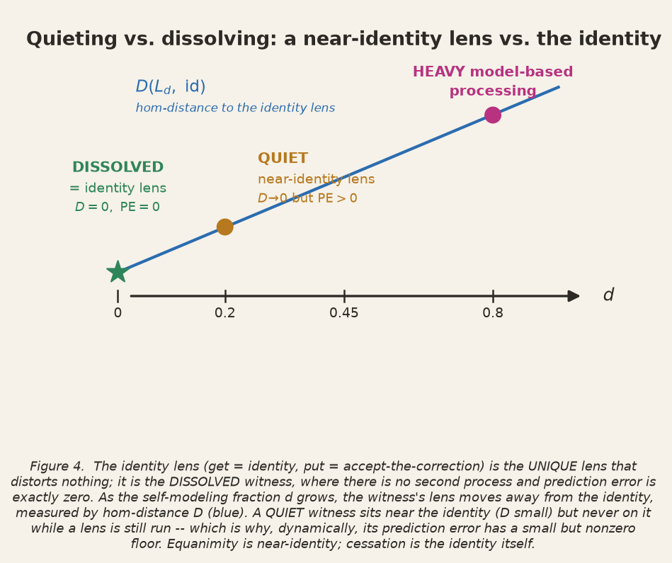
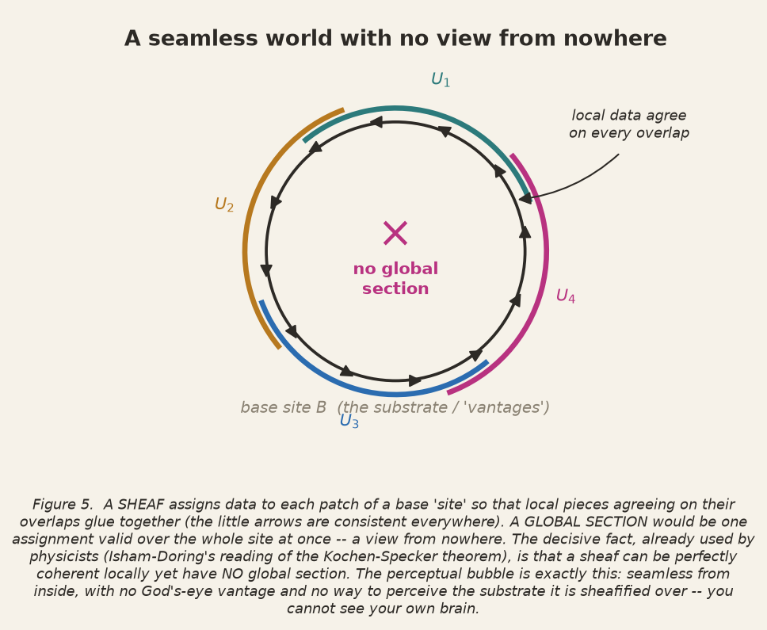
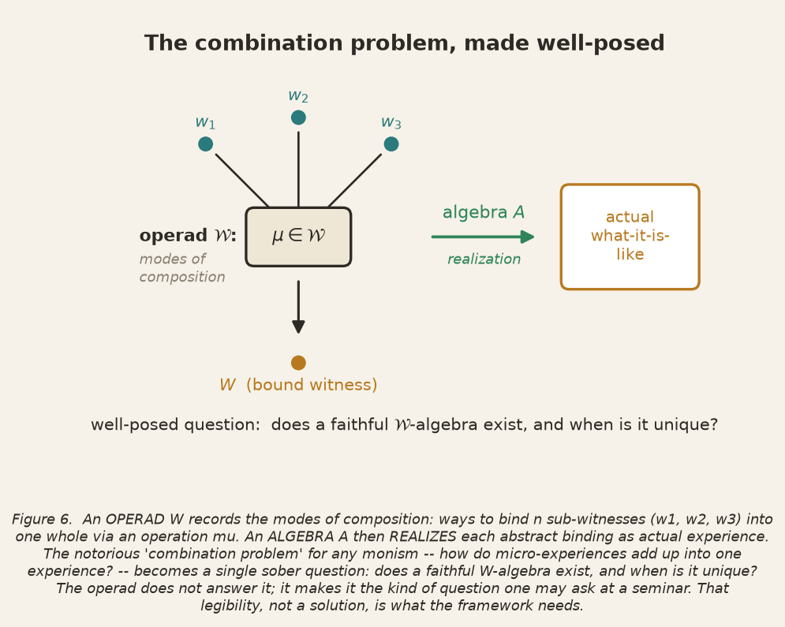

# The Witness That Models Itself

*Experimental metaphysics (XPMP): a dual-aspect, process-ontological account of perception — written
in working code, then carried across six bridges to the empirical disciplines.*

> "Bodies do not produce sensations, but complexes of elements (complexes of sensations) make up
> bodies."
> — Ernst Mach, *The Analysis of Sensations* (1886)

*XPMP Working Notes · June 2026*

---

## Contents

- [**I.** The Residual Gap](#i-the-residual-gap) — *reality vs. expectation; a number that refused to be zero*
- [**II.** A Category-theoretic Bridge](#ii-a-category-theoretic-bridge) — *profunctors, lenses, sheaves, operads*
- [**III.** A Semiotic Bridge of Signs and Indices](#iii-a-semiotic-bridge-of-signs-and-indices) — *in preparation*
- [**IV.** A Scale-Invariant Bridge](#iv-a-scale-invariant-bridge) — *in preparation*
- [**V.** A Neurological Bridge](#v-a-neurological-bridge) — *in preparation*
- [**VI.** A Geometry Processing Bridge](#vi-a-geometry-processing-bridge) — *in preparation*
- [**VII.** A Hippie Bridge](#vii-a-hippie-bridge) — *in preparation*

---

## I. The Residual Gap

*Reality vs. expectation — a small simulation, and a number that refused to be zero.*

There is a class of monisms — Mach's neutral elements, Lehar's perceptual bubble — that refuse the
map-and-territory picture. They hold that perception and reality are not two things in a
correspondence relation but one thing under an equivalence: the world-as-experienced is the only
world you ever occupy. The brain that renders it is, from the inside, unrenderable. You cannot
perceive your own neural substrate first-person; it shows up only third-person and only after the
fact, on an ECoG trace someone else reads back to you. We take that asymmetry of access not as an
embarrassment for monism but as its signature. One ground; two irreducible modes of presentation.
Our mentor calls it dual-aspect nondualism — a *symmetric asymmetry*.

This post is about a small simulation that tries to make one corner of that picture move, and about
a feature it surfaced that I find more instructive than anything I deliberately put in.

### The setup

Call the thing that experiences a **witness user** — a perceptual process, "what it is like to be
like something." A witness user *rolls out* reality: it lives a single trajectory through time. We
notate this `3+1` — three spatial degrees of freedom carried along one proper-time axis. In the
model it is just a point `r(t) ∈ ℝ³` drifting toward an attractor (the optimal path) under
irreducible process noise. Nothing is rolled out frictionlessly.

But witness users do something else. They *model the very process they are.* They run an emulator —
a simulation of their own trajectory — and that emulator has expectations about where the roll-out
is going. We notate it `3.3+1`. The fractional ".3" is not a Hausdorff dimension; it is a pragmatic
dial. It is the fraction of the system's dynamics devoted to modeling *itself* rather than simply
being itself. Call it `d`. At `d = 0` the system makes no self-model. As `d` climbs, more of the
trajectory is given over to the emulator's own predictions.

The emulator is where the metaphysics gets cashed out as two distinct noise channels, because
model-based processing is not one thing:

- **Thought chains** are predictive models. In the simulation they appear as a coherent,
  low-frequency drift toward a *biased* goal — the emulator chasing a target slightly displaced from
  the real one. Structured, articulate, and subtly wrong.
- **Strong emotions** — doubt, fear, hesitation — are not predictions but high-variance bursts.
  They are intermittent and they hinder the optimal roll-out rather than redirecting it.

The divergence between expectation `3.3+1` and reality `3+1` is **prediction error**, in the Active
Inference sense: `PE(t) = ‖e(t) − r(t)‖`. The Fristonian commitment we add is that the witness user
does not merely do predictive processing *of the world*; it does generative modeling *of the
experience of the perceptual process itself*. The emulator's object is the roll-out, not the
furniture.

**Figure I.1** — The reality roll-out `3+1` (teal) against the emulated expectation `3.3+1` (amber):
the 3D trajectories, the headline progress curves, the prediction-error divergence, and the
`d`-sweep from enlightened quietude to heavy model-based processing. *Reproduce:*
`./experimental_metaphysics/bin/python reality_vs_expectation.py`.

### The coupling is the whole point

It would be easy and wrong to model this as tracking — emulator chases reality, reality ignores
emulator. The interesting claim is that the two curves *diverge and perturb each other*. So the
coupling runs both ways:

- `e ← r`: **observation.** Expectation is pulled toward reality with a precision gain `β`.
- `r ← e`: **enaction.** Acting on expectation nudges reality itself with gain `α`. The model writes
  back onto the world it models.

This is the symmetric asymmetry rendered as dynamics. The coupling is symmetric — both terms are
present — but the *access* is asymmetric. Reality never reads the emulator's internals; it only feels
the enacted push, the way a witness user never perceives its own substrate but certainly lives the
consequences of having one. The arrow from model to world is real, but it is mute about its own
origin.

### What the sweep shows, and what it doesn't

Run the self-modeling fraction from enlightened quietude to heavy rumination and the headline result
is exactly what the framework predicts:

| `d`  | regime                       | mean prediction error |
|------|------------------------------|-----------------------|
| 0.00 | observing only               | 0.147                 |
| 0.15 |                              | 0.150                 |
| 0.30 | ordinary                     | 0.169                 |
| 0.55 |                              | 0.217                 |
| 0.85 | heavy model-based processing | 0.313                 |

More self-modeling, more divergence. The thought-chain drift shows up as a coherent overshoot in the
expectation curve; the emotional bursts show up as the jagged spikes. A witness user who models
itself harder lives further from its own roll-out. That is the contemplative claim — that suffering
is, in part, a precision-weighting problem — rendered as a monotone column of numbers.

But look at the top row. At `d = 0` the prediction error is not zero. It is 0.147.

### The residual gap (which is not a bug)

I want to be honest about this, because it is the most interesting thing the model did, and the
temptation is to "fix" it.

At `d = 0` the emulator runs no predictions of its own. It is pure observation: it tracks reality
with gain `β` and nothing else. And yet it still lags. A first-order tracker of a noisy process is
always a step behind, and reality's irreducible process noise keeps leaking into the gap faster than
observation can close it. So even an emulator that has been fully quieted — that has stopped
*predicting* entirely — maintains a small, structural, nonzero distance from the trajectory it
observes.

This pried apart two claims I had been treating as one. The framework says an enlightened witness
user has expectations that "diverge little, or not at all," and that *some witness users may have no
emulator whatsoever.* I had assumed these were endpoints of the same axis — that "not at all" was
just the `d → 0` limit of "little." The simulation says no. There are two different regimes:

- **The quiet emulator** (`d → 0`, emulator still present): low but **irreducibly nonzero**
  prediction error. The self-model has gone silent but it has not gone away, and because it still
  *observes*, it still lags. This is equanimity, not cessation. You can attenuate the predictions to
  nothing and a residual gap survives, sustained entirely by the act of watching.
- **The dissolved emulator** (`e ≡ r`, no emulator at all): prediction error **identically zero**,
  because there is no second process to differ. There is nothing modeling the roll-out; there is only
  the roll-out.

These are not the same point reached by different roads. They are different roads. And the gap
between them is, I think, exactly the seam the whole framework is named for. The quiet emulator is
still *dual-aspect*: two processes, one nearly slaved to the other, separated by a residual lag that
observation itself generates. The dissolved emulator is *bare nondualism*: one process, no aspect to
stand against another, no one home to be a step behind. The residual 0.147 is the width of the
dual-aspect regime. It is what it costs, in divergence, to still be looking.

This maps onto a distinction the contemplative literature gestures at and usually blurs — between
the cultivation of equanimity (the witness grows quiet, steady, minimally reactive, but a witness
remains) and the cessation of the witness as a separate locus (the gap is not narrowed but
abolished). The model did not know that literature. It produced the distinction anyway, as the
difference between a limit and an identity. A tracker driven to silence is not the same object as no
tracker. `lim_{d→0} PE > 0`; `PE|_{no emulator} = 0`. The inequality is the finding.

**Figure I.2** — The same finding, retyped as categorical cybernetics (see §II). **(A)** the static
hom-distance to the identity lens, exactly zero at `d = 0`; **(B)** the dynamic prediction error, with
its nonzero floor and the dissolved-witness point pinned at exactly zero; **(C)** the two metrics
tracking each other across the sweep (corr = 1.00); **(D)** a quiet witness still lags over time while
only dissolution is flat. *Reproduce:* `./experimental_metaphysics/bin/python emusim3p1.py`.

### Why I am leaving it in

The reflex is to drive the residual to zero — slave the emulator harder, raise the observation gain,
declare the enlightened limit "clean." That would be modeling the metaphysics I wanted instead of
the one the dynamics implies. The honest move is to keep the residual and let it mean something: the
irreducible cost of an aspect that observes. The witness that watches without predicting has not
escaped divergence; it has reached the floor of divergence, and that floor is set by the bare fact of
watching a noisy roll-out at all. To get to zero you do not need a *better* witness. You need one
fewer process.

That is a sharper claim than the one I started with, and I did not author it. The simulation handed
it to me as a number that refused to be zero. Which is, more or less, what you hope a model of a
self-modeling process will do: model something you did not already believe.

---

## II. A Category-theoretic Bridge

The first half reported a finding. This half earns the right to report it *in mixed company* — to
state it to a reader trained in dynamical systems or Bayesian inference without being shown the door.
That requires naming the apparatus I have been leaning on, because words like *sheaf*, *lens*, and
*Para* have so far been doing load-bearing work while standing offstage. I will not run a category-
theory course. I will define exactly the terms the argument touches, and then show why the bridge
those terms build is *justifiable* rather than ornamental.

Start with the one commitment everything rests on. A **category** is a collection of *objects* and,
between them, *arrows* that compose: given $f : A \to B$ and $g : B \to C$ there is $g \circ f : A \to C$,
the composition is associative, and every object has an identity arrow. The discipline's wager — and
the reason it suits a process ontology — is that an object is known *only* through its arrows, never
through any inner substance. A **functor** $F : \mathcal{C} \to \mathcal{D}$ is a translation between
two such worlds that respects this grammar:

$$ F(g \circ f) = F(g) \circ F(f), \qquad F(\mathrm{id}_A) = \mathrm{id}_{F(A)}. $$

Here is the first thing to get right, because it is where most "consciousness, categorically"
gestures quietly cheat. A functor $\mathcal{X}_{\text{XPMP}} \to \mathbf{Math}$ would assert that every
phenomenal arrow *is* a mathematical one — that the territory is a sub-structure of the map. XPMP
forbids exactly this. So the bridge cannot be a functor. The correct object is a **profunctor**,
written $B : \mathcal{X} \nrightarrow \mathcal{E}$ and defined as an ordinary functor

$$ B : \mathcal{X}^{\mathrm{op}} \times \mathcal{E} \longrightarrow \mathbf{Set}, $$

which assigns to each phenomenal object $x$ and each empirical object $e$ a *set* $B(x,e)$ — read as
"the admissible ways the STEM-structure $e$ may *stand in for* the phenomenal $x$, without being it."
A profunctor is a relation between categories that privileges neither. Its **collage** $\int B$ is the
single category you get by placing $\mathcal{X}$ and $\mathcal{E}$ side by side and letting $B$ supply
the only arrows across the divide; it has $\mathcal{X}$ and $\mathcal{E}$ as its two boundaries, joined
but neither contained in the other. *That* is the rigorous content of the cobordism metaphor:
a structure whose two edges are the phenomenal and the empirical, with genuine passage between them and
no collapse of one into the other. The justifiability of the whole project lives in this one move —
and so does its humility, which I will return to at the end.

**Figure 1** — The bridge is a *profunctor*, not a functor: the phenomenal world and the empirical
world are joined by admissible stand-ins into a single *collage*, the rigorous reading of "cobordism."
Neither side is contained in the other.

**Lens (the witness, Idea I).** A *lens* is a single arrow carrying two components of *different type*:

$$ \mathrm{get} : S \to A \qquad\text{(observation)}, \qquad \mathrm{put} : S \times A' \to S' \qquad\text{(enaction)}. $$

The forward $\mathrm{get}$ reads an appearance out of a state; the backward $\mathrm{put}$ takes a state
*and* a correction and writes a new state. These do not reduce to one another — $\mathrm{put}$ depends
essentially on the input $\mathrm{get}$ saw — and they point opposite ways. This is precisely the
*symmetric asymmetry* with a type signature: one morphism, two irreducible aspects. The witness is a
lens whose $\mathrm{get}$ is the third-person trajectory-as-viewed and whose $\mathrm{put}$ is the
first-person world-changed-by-being-modeled. The **identity lens** $\mathrm{id}_S$ — with
$\mathrm{get} = \mathrm{id}$ and $\mathrm{put}(s, s') = s'$ (accept the correction wholesale) — is the
*only* lens that distorts nothing. The dissolved witness *is* this morphism; the quiet witness is
*near* it. The residual gap of Part I is, in this language, a hom-distance: how far the witness's lens
sits from the identity.

**Figure 2** — The witness as a *lens*: a forward `get` (observation, third-person) and a backward
`put` (enaction, first-person) — one morphism, two irreducible aspects. Dual-aspect nondualism with a
type signature.

**Para (the self-modeling fraction, Idea I).** A lens with fixed wiring cannot *learn*. The **Para**
construction supplies the missing handle: a parametrized arrow $A \to B$ is a pair

$$ (P,\; f : P \otimes A \to B), $$

a map equipped with a *parameter object* $P$ that it carries alongside its input, plus 2-cells that
*reparametrize* — slide $P$ to a new value. This is the categorical home of learning: gradient descent,
Bayesian updating, and active-inference's free-energy descent are all reparametrization in $\mathrm{Para}$.
Our self-modeling fraction $d$ — the "$.d$" of $3.d+1$ — is an element of that parameter object. Walking
$d$ from $0$ upward is literally a path through $\mathrm{Para}$'s parameter space, and the $d$-sweep of
Part I is that walk, sampled.

**Figure 3** — *Para*: the self-modeling fraction `d` enters as a parameter wire; sliding it
(reparametrization) is what learning and active inference *are*.

**Figure 4** — Quieting versus dissolving. The *dissolved* witness is the identity lens (zero
distortion, zero error); the *quiet* witness sits near it but never on it while a lens still runs.
Equanimity is near-identity; cessation is the identity itself — the typed restatement of Figure I.2.

**Sheaf, site, global section (the bubble, Idea II).** A **presheaf** on a category $\mathcal{C}$ is a
functor $F : \mathcal{C}^{\mathrm{op}} \to \mathbf{Set}$ — data assigned to each object, pulled back along
each arrow. A **site** is a category equipped with a notion of *covering* (which families of arrows count
as "covering" an object). A **sheaf** is a presheaf whose data is *local-to-global coherent*: whenever a
family $\{U_i\}$ covers $U$, sections that agree on overlaps glue uniquely to a section on $U$:

$$ F(U) \cong \lbrace (s_i) \in \prod_i F(U_i) \mid s_i = s_j \text{ on } U_i \cap U_j \rbrace. $$

A **section** over $U$ is just an element of $F(U)$ — a coherent local datum. A **global section** is a
section over the whole site at once: a single consistent assignment valid everywhere, a view from
nowhere. The perceptual bubble is a sheaf over a site of *vantages*: the witness commands every local
section — the rendered world is seamless from inside — yet the *site itself*, the substrate over which
the rendering is sheafified, is not an object the witness can name. And here is the load-bearing fact,
the one with a precedent physicists already accept: such a sheaf can be perfectly coherent locally and
yet possess **no global section** at all. That is not mysticism; it is exactly the form of the
Kochen–Specker theorem in Isham and Döring's topos treatment of quantum mechanics — *there is no
consistent God's-eye valuation, only contextual local ones.* "You cannot see your own brain" and "there
is no global section" are the same sentence in two dialects. (A **topos** is the ambient category of all
sheaves on a site; its internal logic is intuitionistic — excluded middle fails — which is why
counterfactual roll-outs can carry *capacity-to-actualize* without yet being true or false.)

**Figure 5** — A *sheaf* can be seamless locally yet have *no global section* — no view from nowhere.
Structurally the Kochen–Specker situation: you cannot see your own brain because the substrate is the
site, not a section.

**Operad, algebra (the combination problem, Idea III).** An **operad** $\mathcal{W}$ records modes of
composition: for each list of inputs it gives a set $\mathcal{W}(c_1,\dots,c_n;\,c)$ of ways to bind $n$
parts into one whole, closed under substitution. An **algebra** over it is a functor that *realizes*
each abstract binding as an actual structure. Cast the parts as sub-witnesses and the question that has
sunk every neutral monism — *how do micro-experiences combine into one experience?* — becomes a single
sober line: *does a faithful $\mathcal{W}$-algebra exist, and when is it unique?* The operad does not
answer it. It makes it the kind of question one is allowed to ask at a seminar. That, and not a solution,
is what the apologist needs.

**Figure 6** — The *witness operad*: binding sub-witnesses into a whole, realized by an *algebra*. The
combination problem becomes a well-posed question — does a faithful algebra exist, and when is it
unique?

**Why this is a justifiable bridge, and not a sleight of hand.** Return to the profunctor. Because $B$
is only required to be a *functor into $\mathbf{Set}$* — not full, not faithful, not an embedding — the
translation is permitted to lose information, and it is *not permitted* to legislate the source. Two
consequences follow, and they are the whole ethics of the exercise. First, the bridge carries real
structure across: a constraint provable on the empirical side (an identity lens is the unique
zero-distortion lens; a sheaf may lack a global section) becomes a statement the apologist may *export*
into the phenomenal account with a clear conscience, because the arrow is structure-preserving where it
exists. Second — and this is the protection the closeted apologist actually wants — when a STEM critic
breaks the model, the critic has broken the map, not the territory. The failure of a non-faithful
translation cannot refute its source. This is not evasion; it is the precise meaning of "XPMP does not
presuppose mathematics as a subset of itself," written as a property of $B$.

The skeptic's sharpest reply survives all of this: *you have described, not explained.* It is correct.
But it was the commission. A cobordism is not a proof that the two shores are the same land; it is a
way to walk between them without pretending either is the other. The most an honest apologist should
claim is constraint-bearing description that *travels* — and the difference between that claim and the
crackpot's is the entire distance this section was written to mark.

---

## III. A Semiotic Bridge of Signs and Indices

*In preparation.*

---

## IV. A Scale-Invariant Bridge

*In preparation.*

---

## V. A Neurological Bridge

*In preparation.*

---

## VI. A Geometry Processing Bridge

*In preparation.*

---

## VII. A Hippie Bridge

*In preparation.*

---

### Colophon

All figures and results are reproducible from the project repository, in the isolated environment
`experimental_metaphysics`:

| Artifact | Produces |
|---|---|
| `reality_vs_expectation.py` | Figure I.1 — the dual-trajectory simulation and `d`-sweep |
| `emusim3p1.py` | Figure I.2 — the witness retyped as a `Para(Lens)`; residual gap as hom-distance |
| `ct_diagrams.py` | Figures 1–6 — the category-theory diagrams |
| `category_theory_bridge.md` | the long-form notes behind §II |
| `figures.md` | the standalone figure index |

*Numbers are arbitrary but meaningful — every parameter is a metaphysical commitment written down as
a float.*
